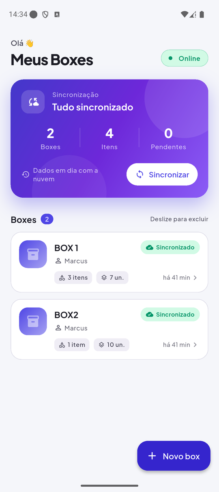
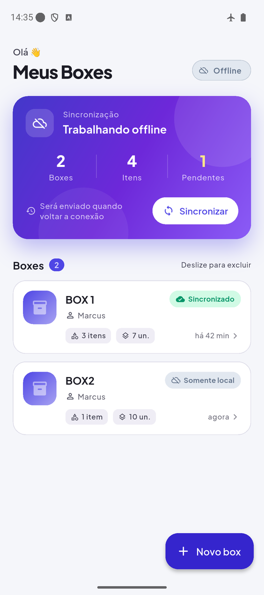
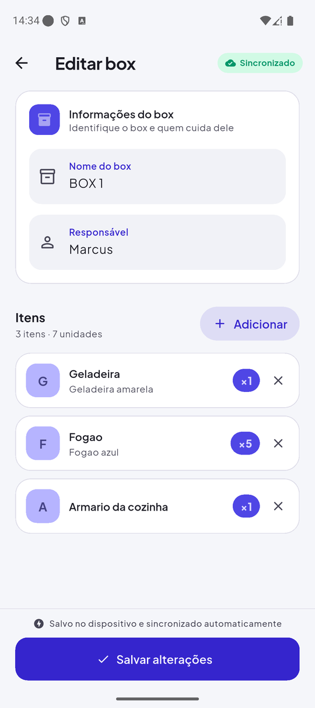
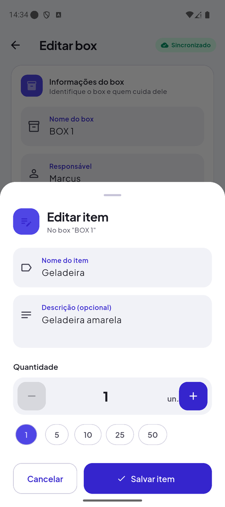
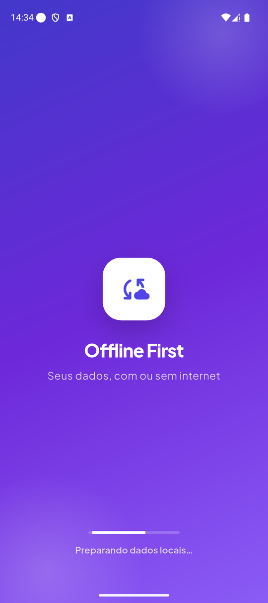
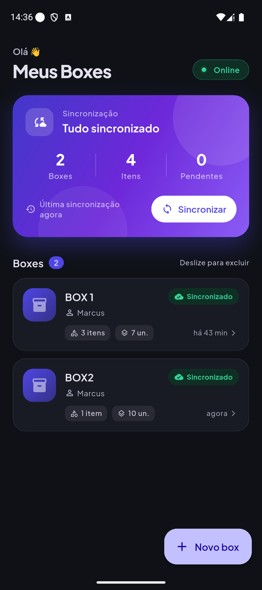
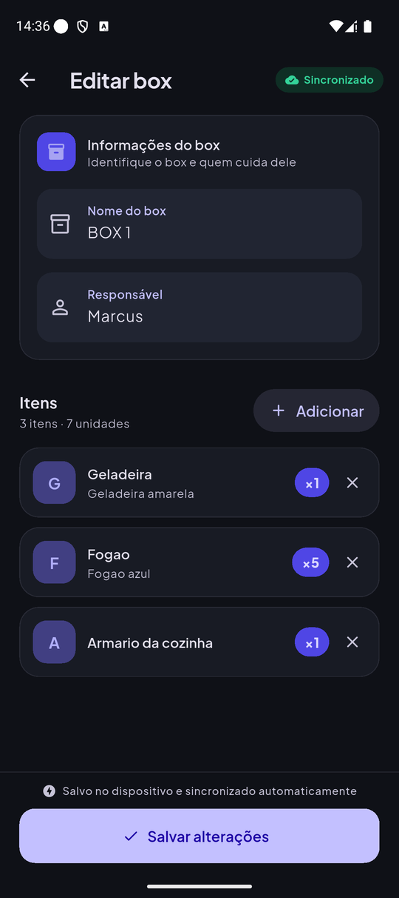
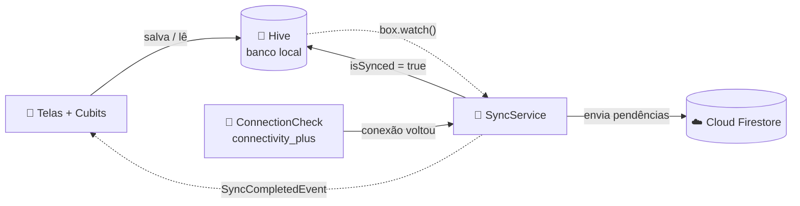
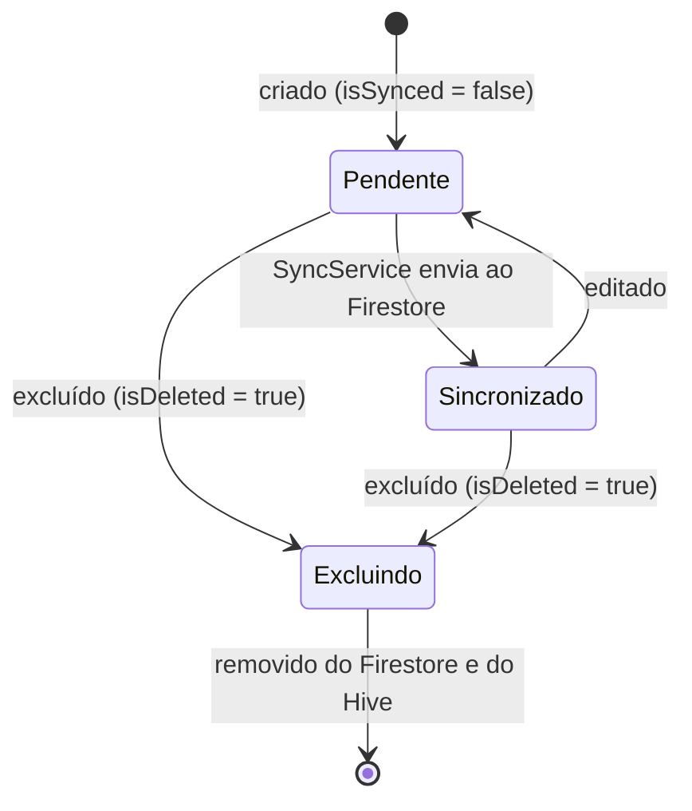
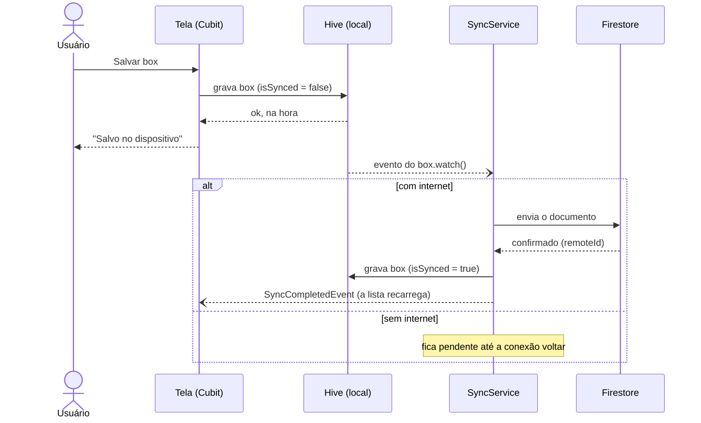

<div align="center">

# ☁️ Offline First · Flutter

**Cadastre, edite e exclua sem internet. Quando a conexão voltar, tudo sincroniza sozinho.**

App de demonstração do padrão *offline first* em Flutter: os dados vivem primeiro no dispositivo ([Hive CE](https://pub.dev/packages/hive_ce)) e são enviados para a nuvem ([Cloud Firestore](https://firebase.google.com/docs/firestore)) em segundo plano, sempre que houver conexão.


</div>

---

## 📸 Telas

<table>
  <tr>
    <td align="center"><br><sub><b>Online</b> · tudo sincronizado</sub></td>
    <td align="center"><br><sub><b>Offline</b> · alterações pendentes</sub></td>
    <td align="center"><br><sub>Cadastro do box e seus itens</sub></td>
    <td align="center"><br><sub>Item em bottom sheet</sub></td>
  </tr>
  <tr>
    <td align="center"><br><sub>Splash</sub></td>
    <td align="center"><br><sub>Tema escuro</sub></td>
    <td align="center"><br><sub>Tema escuro</sub></td>
    <td></td>
  </tr>
</table>

---

## 💡 O que é offline first?

Em um app tradicional (*online first*), cada ação depende do servidor. Sem internet, nada funciona. No *offline first*, a lógica é invertida:

1. **O banco local é a fonte da verdade.** Toda leitura e escrita acontece no dispositivo, na hora, sem esperar a rede.
2. **A nuvem é uma réplica.** Alterações ficam marcadas como pendentes e são enviadas em segundo plano.
3. **A conexão é um detalhe.** Caiu a internet? O usuário continua trabalhando. Voltou? A fila de pendências é sincronizada automaticamente.

O resultado é um app instantâneo e resiliente, que não perde dados por falta de sinal.

## 🧭 O que a demo mostra

- 📦 Cadastro de **boxes** (nome e responsável) com seus **itens** (nome, descrição e quantidade)
- ⚡ Salvamento instantâneo no dispositivo, com ou sem internet
- 🔄 Sincronização automática ao salvar, ao abrir o app e quando a conexão volta
- 👀 Sincronismo visível o tempo todo: status da rede, pendências em tempo real, última sincronização e um selo em cada box
- 🗑️ Exclusão que também funciona offline e é enviada para a nuvem depois

---

## ⚙️ Como funciona

### Visão geral



A interface **nunca fala direto com o Firestore**. Ela só lê e grava no Hive. Quem conversa com a nuvem é o `SyncService`, que observa o banco local e envia o que estiver pendente sempre que houver conexão.

### Os campos que controlam o sincronismo

Cada box (`BoxContainerModel`) carrega os metadados de sincronização:

| Campo | Papel |
|---|---|
| `id` | UUID gerado **no dispositivo**, então não depende do servidor para existir |
| `isSynced` | Vira `false` sempre que o box é criado, editado ou excluído localmente, e `true` quando o Firestore confirma o envio |
| `isDeleted` | Exclusão suave: o box some da lista, mas fica no Hive até a exclusão chegar à nuvem |
| `remoteId` | ID do documento no Firestore; fica `null` até o primeiro envio |
| `updatedAt` | Momento da última alteração |

### Ciclo de vida de um box



### O caminho de uma gravação



### Quando a sincronização acontece

| Gatilho | Onde |
|---|---|
| Ao abrir o app: envia pendências e, se o banco local estiver vazio, baixa os dados da nuvem | `SplashModule.onInit` → `SyncService.startSync()` e `initialSync()` |
| A cada alteração no Hive | `SyncService.watch()` |
| Quando a conexão volta | `ConnectionCheck.startListening()` |
| Manualmente | botão **Sincronizar** ou *pull to refresh* na Home |

### O sincronismo na interface

| Elemento | O que mostra |
|---|---|
| Pílula no topo | 🟢 **Online** · ⚪ **Offline** · 🟡 **Sincronizando** |
| Card de sincronização | Total de boxes e itens, **pendentes em tempo real**, última sincronização e botão **Sincronizar** |
| Selo em cada box | **Sincronizado** · **Pendente / Enviando** · **Somente local** (quando está offline) |

Esses elementos reagem sozinhos a `ValueNotifier`s expostos pelo core: `ConnectionCheck.isOnline`, `SyncService.isSyncing` e `SyncService.lastSyncAt`. O contador de pendentes é lido direto do Hive com `box.listenable()`.

---

## 🏗️ Arquitetura e stack

| Camada | Tecnologia |
|---|---|
| Banco local | `hive_ce` + `hive_ce_flutter` |
| Nuvem | `cloud_firestore` |
| Conectividade | `connectivity_plus` |
| Estado | Cubits (`flutter_bloc`) |
| Injeção de dependências e rotas | `flutter_getit` |
| Eventos entre camadas | `event_bus` |
| IDs locais | `uuid` |
| UI | Material 3, tema claro e escuro, fonte Plus Jakarta Sans embarcada (funciona offline) |

```
lib/
├── main.dart                    # inicializa Firebase, Hive e os adapters
└── src/
    ├── app.dart                 # MaterialApp, temas e módulos
    ├── core/
    │   ├── connection_check/    # escuta a rede e dispara o sync
    │   ├── repositories/        # Hive (local) + Firestore (remoto)
    │   ├── services/
    │   ├── sync/                # SyncService e SyncCompletedEvent
    │   └── ui/                  # tema, cores de status e widgets compartilhados
    ├── data/models/             # BoxContainerModel e ItemContainerModel (Hive)
    └── features/                # um módulo por feature (data / domain / presentation)
        ├── splash/              # carga e sincronização inicial
        ├── home/                # lista de boxes e painel de sincronização
        └── create_container/    # cadastro e edição de box e itens
```

---

## 🚀 Como rodar

**Pré-requisitos**

- Flutter **3.47.5** (versão fixada no `.tool-versions`; com [asdf](https://asdf-vm.com), basta `asdf install`)
- Um projeto Firebase com o **Cloud Firestore** habilitado
- Emulador ou aparelho **Android**

```bash
git clone https://github.com/brasizza/offline-first-flutter.git
cd offline-first-flutter
flutter pub get

# Opcional: apontar para o seu próprio projeto Firebase
dart pub global activate flutterfire_cli
flutterfire configure

flutter run
```

> [!NOTE]
> Os boxes são gravados na coleção **`containers`** do Firestore. Para a demo, as regras de segurança precisam permitir leitura e escrita nessa coleção.

Se alterar os models do Hive, gere os adapters novamente:

```bash
dart run build_runner build --delete-conflicting-outputs
```

---

## 🎤 Roteiro para apresentar

1. Abra o app com internet: a pílula mostra **Online** e o card diz **Tudo sincronizado**.
2. Ative o **modo avião**. A pílula muda para **Offline**.
3. Crie um box com alguns itens. Ele aparece na hora, com o selo **Somente local**, e o contador de **Pendentes** sobe.
4. Edite ou exclua outro box. Tudo continua funcionando.
5. Desative o modo avião. O card mostra **Enviando alterações…**, os selos ficam **Sincronizado** e os pendentes voltam a zero.
6. Abra o console do Firestore e mostre os documentos na coleção `containers`.

---

## 🧩 Criando novas features

O projeto tem um brick do [Mason](https://pub.dev/packages/mason_cli) que gera o esqueleto de uma feature (módulo, cubit, página, use case e repositório):

```bash
dart pub global activate mason_cli
./make_feature.sh nome_da_feature   # cria em lib/src/features/nome_da_feature
```

---

## ⚠️ Limitações conhecidas

Por ser uma demonstração, algumas escolhas foram simplificadas:

- **A última gravação vence.** Não há resolução de conflitos: o envio local sobrescreve o documento remoto.
- **Os dados remotos só são baixados na primeira carga**, quando o banco local está vazio. Edições feitas em outro aparelho não são puxadas depois.
- **Itens não têm estado de sync próprio.** Qualquer mudança em um item marca o box inteiro como pendente.
- **Não há novas tentativas automáticas com espera progressiva.** Um envio que falha fica pendente até o próximo gatilho (nova alteração, reconexão ou botão Sincronizar).
- **Online não garante internet.** O `connectivity_plus` detecta a interface de rede: um Wi-Fi sem internet conta como online.

---

## 🙌 Créditos

- Fonte [Plus Jakarta Sans](https://github.com/tokotype/PlusJakartaSans), sob a SIL Open Font License (`assets/fonts/OFL.txt`)
- Feito por [Marcus Brasizza](https://github.com/brasizza)
